# XUM1541 Pro Micro

[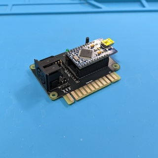](images/XUM1541_Finished_Front.jpg?raw=1)
[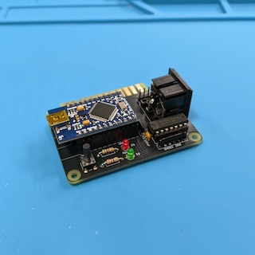](images/XUM1541_Finished_Back.jpg?raw=1)

The XUM1541 allows to connect devices that use the Commodore serial bus (IEC
bus) to modern computers via USB. You usually use it to create images of old
1541 or 1571 floppy disks by using a software called
[OpenCBM](https://github.com/OpenCBM/OpenCBM).

## Ordering the PCB

The subdirectory "gerber-files" contains a Zip file you can use to order the PCB
from PCB manufacturers like PCBWay or JLCPCB. Simply upload the Zip on their web
page. When you plan to use the parallel port option, you have to order a PCB
that has the default thickness of 1.6mm, and I recommend to order a surface
finish of ENIG with gold fingers and chamfered edges, because it is much more
durable than the default HASL finish.

## Building the Adapter

### Bill of Materials

* __1x Pro Micro ATmega32U4 5V 16MHz Board__.

  There are two variants of this board, a 5V variant with 16MHz clock
  frequency, and a 3V variant with 8MHz. Make sure that you get the 5V variant!
  Also make sure that you get a Pro Micro Board based on the ATmega32U4. There
  are Pro Micro Boards available based on the Raspberry Pi Pico, these do not
  work!

  These boards come in at least three different widths. This XUM1541 PCB is
  designed to support all three widths (the distance between the two rows of
  pins can be either 15.24mm, 17.78mm or 20.32mm).

* __2x 1x12 Pin Headers Through Hole Straight 2.54mm pitch__

  These go onto the Pro Micro board. They should be included with the Pro Micro
  board.

* (Optional) __2x 2x12 Pin Sockets Through Hole Straight 2.54mm pitch__.

  These are used to connect the Pro Micro Board to the XUM1541 PCB. They are
  optional, you can solder the Pro Micro directly to the PCB instead.

* __1x 6 Pin DIN socket Right Angle PCB mount__.

  The footprint is for Lumberg 010599 06 or equivalent sockets.

* (Optional) __1x 74LS06 Hex Inverter Buffers DIL-14__ (U1).

  Using this buffer chip is strongly recommended, especially when your're
  daisychaining more than one device on the IEC bus, but it is optional. When
  you install it, you should also install the capacitor C1 and the register
  network RN2. When you do not install it, you have to close the corresponding
  5 solder jumpers on the bottom of the XUM1541 PCB.

* (Optional) __1x IC Socket DIL-14__ (U1).

  Socket for the 74LS06. It is optional, you can alternatively solder the IC
  directly onto the XUM1541 PCB.

* (Optional) __1x Ceramic Capacitor 100nF 2.5mm pitch__ (C1).

  This is the blocking capacitor for U1. It is optional, you only need to
  install it when you install the 74LS06.

* (Optional) __1x Resistor Network 5x100kOhm SIL-6 Star Connection__ (RN2).

  This resistor network is only needed when installing the 74LS06. It pulls the
  inputs of the 74LS06 to ground.

* (Optional) __1x Resistor Network 5x4.7kOhm SIL-10 Single Resistors__.

  This resistor network is not used when you do not install the 74LS06.
  
  When you do install the 74LS06, you may optionally install this resistor
  network to limit the amount of current on the IEC bus. When you install the
  74LS06 and decide to leave this resistor network unpopulated, you have to
  close the corresponding 5 solder jumpers on the bottom of the XUM1541 PCB.

* (Optional) __1x Push Button 6x6mm__ (SW1).

  A reset switch that resets the Pro Micro, i.e. puts it into bootloader mode
  for 8 seconds. Completely optional, but having this switch makes installing
  a new firmware much more simple.

* (Optional) __2x LEDs 3mm or 5mm__ (D1 and D2).

  These are the power and activity LEDs. You can use any color you want, e.g.
  red for power and green for activity. These LEDs are optional, there are
  already corresponding LEDs on the Pro Micro board. When you install them, you
  also have to install matching series resistors R1 and R2. The activity LED
  requires an installed 74LS06!

* (Optional) __2x Resistors size 0207__ (R1 and R2).

  These are the series resistors for the LEDs D1 and D2. Of course they are only
  required when you actually install these LEDs! Their value depends on the
  types of LEDs you use (color) as well as the brightness you want to get. I
  recommend that you use a breadboard and check which values are ok for you.

* (Optional) __1x 1x3 Pin Headers Through Hole Straight 2.54mm pitch__

  This is a header for a serial TTL connection to the ATmega. This is only
  needed when you want to debug the XUM1541 firmware running on the
  microcontroller. You will probably not need this header. When you use it,
  keep in mind that it uses two pins also used by the parallel port of the
  XUM1541, so you will not be able to use both simultaneously.

### Soldering the Pin Headers to the Pro Micro Board

The first step is to solder the two 1x12 pin headers to the Pro Micro board.
I recommend to use a breadboard to make sure that the pin headers are correctly
aligned. But be careful not to drop solder onto the breadboard!

[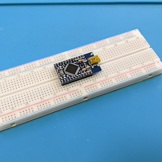](images/Pro_Micro_Pinheaders.jpg?raw=1)

### Soldering the Socket for U1 (74LS06) and the Resistor Networks RN2 and RN1

There are three options for building the XUM1541:

1. The simple version without U1, RN2 and RN1. I generally do not recommend this
   option. You should only connect one single device to the IEC bus when using
   this option. You have to close the five solder jumpers below the U1 footprint
   on the bottom of the PCB, and that is all.

   [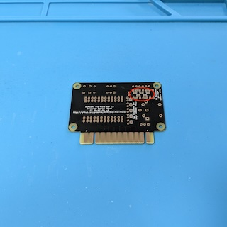](images/Jumpers_U1.jpg?raw=1)

2. The version with U1 and RN2, but without RN1. The 74LS06 on U1 is a buffer
   chip, i.e. it is used to amplify the signals of the Pro Micro and to protect
   the ports of the Pro Micro. It is strongly recommended to install U1 when
   you plan to connect more than one device to the IEC bus. RN2 are pull-down
   resistors to force the inputs of U1 to GND level when not driven by the
   Pro Micro.

   You can either install a DIL-14 socket for U1, or you can directly solder the
   74LS06 IC to the XUM1541 PCB. I personally prefer to use sockets. Make sure
   that the little notch of the socket points to the direction marked on the
   silk screen (to the right on the photo below).

   [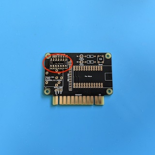](images/Socket_U1.jpg?raw=1)

   I recommend to wait until you are finished with soldering before you install
   the 74LS06 into the socket. Again make sure that the notch of the IC point to
   the direction of the notch of the socket (to the right on the photo).

   Now you have to install the blocking capacitor C1 next to U1.

   [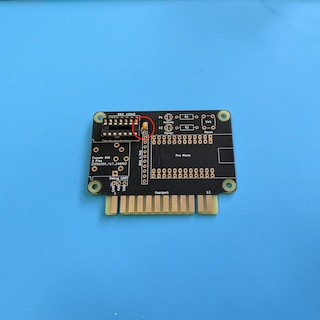](images/Capacitor_C1.jpg?raw=1)

   And you have to install the resistor network RN2 next to U1. Be careful, the
   orientation of this resistor network matters! There is a small dot on the
   resistor network that marks pin 1. Pin 1 is also marked on the silk screen
   of the PCB (left on the picture below).

   [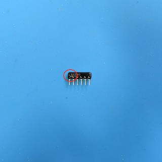](images/Resistor_Network_RN2_Orientation.jpg?raw=1)
   [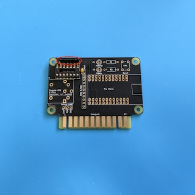](images/Resistor_Network_RN2.jpg?raw=1)

   Because you are not installing resistor network RN1, you have to close five
   solder jumpers on the bottom of the PCB.

   [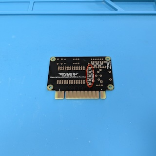](images/Jumpers_RN1.jpg?raw=1)

3. The full version with U1, RN2 and RN1. This is the recommended version. RN1
   limits the current between the IEC bus and the Pro Micro and protects the
   ports of the Pro Micro as well as your valuable retro devices connected to
   the IEC bus. The electric circuit is exactly the same as used for the
   [ZoomFloppy](https://www.go4retro.com/products/zoomfloppy/) available for
   purchase from Retro Innovations.

   Additionally to installing U1 and RN2 (see documentation for variant 2
   above), you have to install resistor network RN1. Unlike resistor network
   RN2, the orientation of the network does not matter, but it is nevertheless
   good practice to solder pin 1 with the dot into the while marked on the silk
   screen (at the top in the picture below).

   [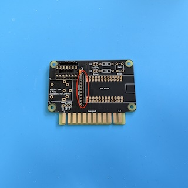](images/Resistor_Network_RN1.jpg?raw=1)

### Soldering the Pin Sockets for the Pro Micro Board

This step is completely optional. You can solder the Pro Micro board directly
onto the XUM1541 PCB, but I prefer to install Pin Sockets.

There are two rows of through-holes on the PCB for each side of the Pro Micro
board. Each pair of rows has the same electrical connections, so you can freely
choose which one to use to adjust to different widths of the Pro Micro. When
the distance of the two rows of pins of your Pro Micro is 15.24mm, use the two
inner rows. When the distance is 20.32mm, use the two outer rows. When the
distance is 17.78mm, you use the outer row on one side, and the inner row on the
other side.

To solder the pin sockets straight, I recommend to stick them onto the pin
headers of the Pro Micro and put them onto the PCB. But again, be careful not
to drop solder onto the Pro Micro!

[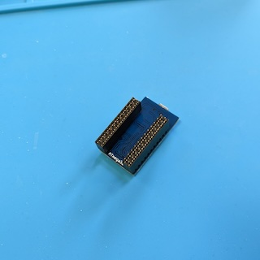](images/Pin_Sockets_ProMicro_Bottom.jpg?raw=1)
[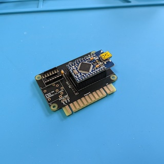](images/Pin_Sockets_ProMicro_Top.jpg?raw=1)

### Soldering the 6 Pin DIN socket

Now solder the 6 pin DIN socket onto the XUM1541 PCB. This is a straightforward
task.

[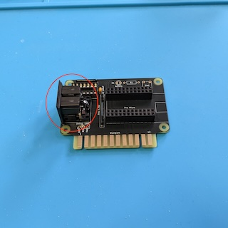](images/DIN6_Socket.jpg?raw=1)

### Soldering the Debug Header

The 1x3 pin header for debugging is optional. It provides a serial interface
with TTL levels and might be helpful when you are making changes to the firmware
of the Pro Micro, because you can use a serial terminal on another computer to
receive debug output from the Pro Micro.

[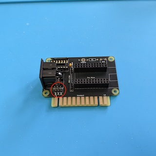](images/Debug_Header.jpg?raw=1)

### Soldering the LEDs and their series resistors

The LEDs for activity and power as well as their respective series resistors are
also optional. There are already corresponding LEDs on the Pro Micro board. I
intentionally do not give any values for the resistors here, because they depend
on the type of LED (color) you use as well as the level of brightness you want
to get. I recommend that you test different resistor values on a breadboard to
determine the right resistor values.

Important: The activity LED requires U1 to be installed!

[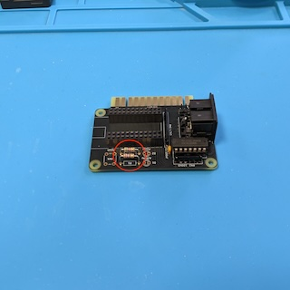](images/Series_Resistors_R1_R2.jpg?raw=1)
[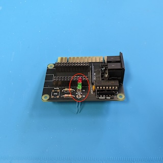](images/LEDs_D1_D2.jpg?raw=1)

### Soldering the Reset Button

The reset button SW1 is optional. Pressing the reset button switches the Pro
Micro into boot loader mode for 8 seconds. Having a dedicated reset switch makes
installing new firmware on the ATmega32U4 a much simpler.

[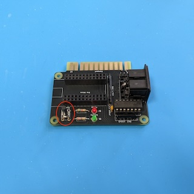](images/Reset_Button_SW1.jpg?raw=1)

## Installing the Firmware

After soldering the XUM1541, you have to install the firmware onto the
Pro Micro. You will find the precompiled firmware in the
[OpenCBM GitHub repository](https://github.com/OpenCBM/OpenCBM/tree/master/xum1541).
Make sure that you fetch the correct firmware:

* When you did not install U1 (74LS06), you have to install the firmware
  "xum1541-PROMICRO-v??.hex", where "??" is the version number.

* When you did install U1, you have to install the firmware
  "xum1541-PROMICRO_7406-v??.hex".

There are many different ways to install the firmware. You can use an Atmel ICSP
programmer (or another Arduino), or you can install the firmware via the USB
port. The Pro Micro usually comes with the Arduino Leonard boot loader
pre-installed. You switch the Pro Micro into boot loader mode by pressing the
reset button. When you did not install the reset button, you have to short the
RST pin of the Pro Micro board to GND. The Pro Micro stays in boot loader mode
only for 8 seconds, so you have to be quick now! I used a software called
"[avrdude](https://github.com/avrdudes/avrdude)" to install the firmware.
avrdude is also used by the Arduino IDE, so a simple way to get avrdude is to
install the Arduino IDE. I used the following command line to install the
firmware:

```
avrdude "-C../etc/avrdude.conf" -v -patmega32u4 -cavr109 "-P/dev/tty.usbmodem2101" -b57600 -D "-Uflash:w:xum1541-PROMICRO_7406-v08.hex:i"
```

Of course you have to adjust the command line, especially the serial port!

## Installing OpenCBM

For installing OpenCBM, I recommend to have a look into the official
"[OpenCBM Users Guide](https://opencbm.trikaliotis.net/)" for more
information.

## License

XUM1541 Pro Micro (c) by Patrick Dähne

XUM1541 Pro Micro is licensed under a
Creative Commons Attribution-NonCommercial-ShareAlike 4.0 International License.

You should have received a copy of the license along with this
work. If not, see <https://creativecommons.org/licenses/by-nc-sa/4.0/>.
